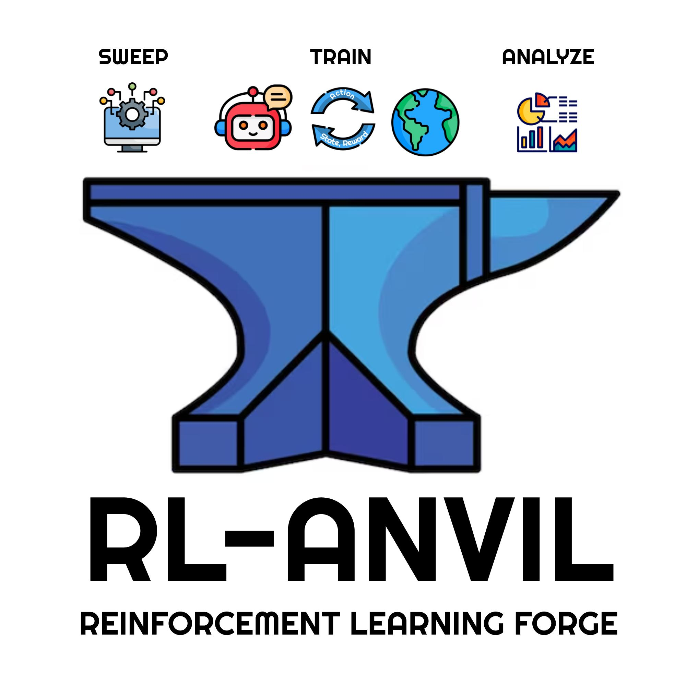
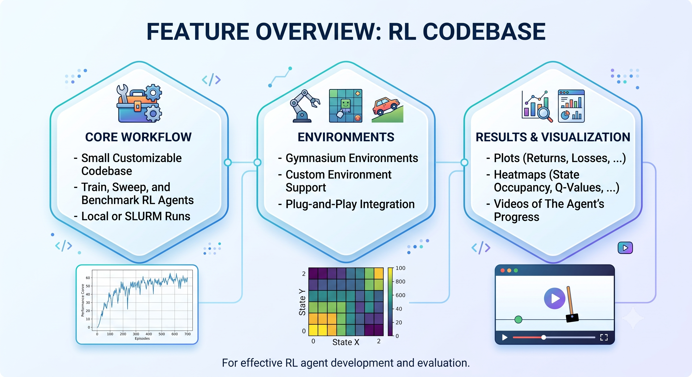
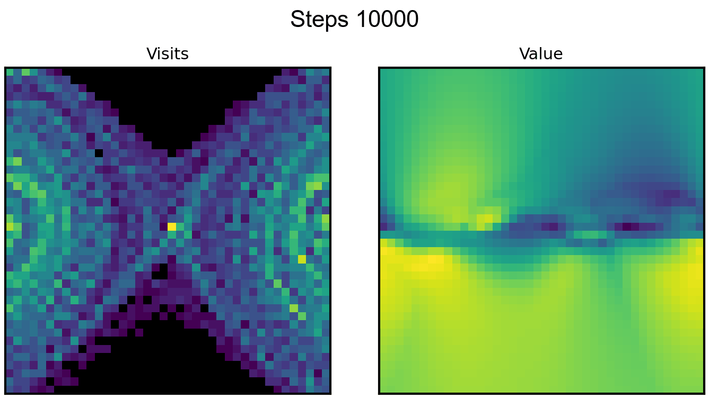
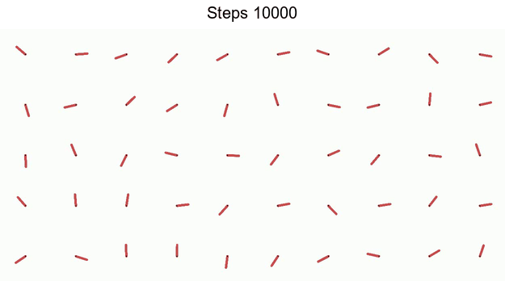
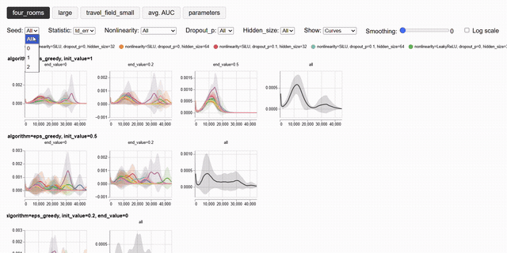
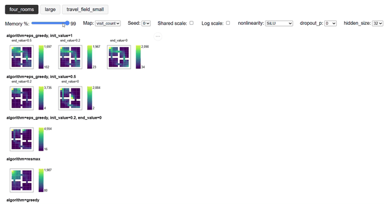
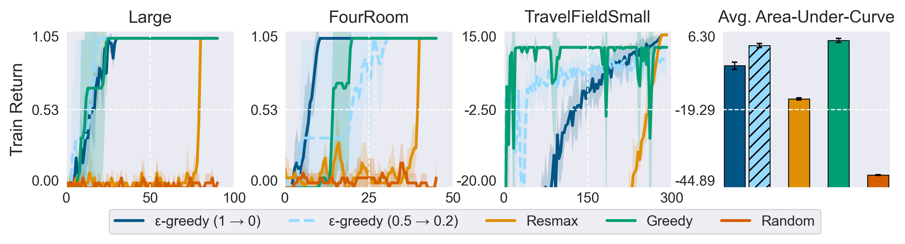
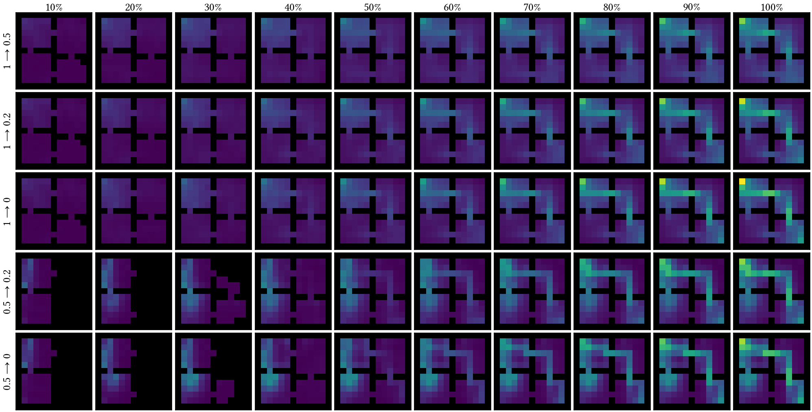

<p align="center">
   &nbsp;&nbsp;&nbsp;&nbsp;&nbsp;
  
</p>

A small customizable codebase to train, sweep, and benchmark RL agents on
Gymnasium environments, locally or on SLURM, with plots, heatmaps, and videos of
what the agent learns. Branches:
- `pytorch` (main) for deep RL algorithms in PyTorch,
- `pytorch_gcrl` for GCRL (code for [SUN: Reaching for Novelty in RL](https://arxiv.org/abs/2609.08642)),
- `tabular` for tabular Q-Learning (useful to quickly prototype algorithms).

## Key Features
- **Launch and monitor sweeps on SLURM.** Resubmitting a sweep skips runs that already
  finished or are still queued, `inspect_jobs.sh` reports on running jobs, and
  `detect_jobs_err.sh` reconstructs what happened to the ones that died.
- **Diagnostics at every checkpoint, not just returns.** Coverage and entropy of the
  visited state-action space, Q-value magnitude, gradient norms, eligibility-trace
  cuts, and optionally heatmaps of the Q-function, videos of the greedy policy, and
  the whole replay memory.
- **Evaluation that is comparable across checkpoints.** The greedy policy is tested at
  every checkpoint against episodes whose reset seeds are fixed for the whole run, so a
  change in the test curve is the policy changing and not a different draw of episodes.
- **Sweep anything in the config**, including the network, from the command line.
- Compatible with any [Gymnasium](https://github.com/Farama-Foundation/Gymnasium/) environment.
- Minimal yet stable implementations of popular RL algorithms (Double DQN, DDPG, PPO, SAC),
  all easy to customize.
- Built on [Hydra](https://hydra.cc/docs/intro/) (configuration and sweeps),
  [Submitit](https://github.com/facebookincubator/submitit) (SLURM),
  [Pandas](https://pandas.pydata.org/) (processing sweep data),
  [W&B](https://wandb.ai/site/), [Rich](https://github.com/Textualize/rich/) (reports), and
  [Matplotlib](https://matplotlib.org/), [Seaborn](https://seaborn.pydata.org/),
  [Vega-Lite](https://vega.github.io/vega-lite/) and [OpenCV](https://opencv.org/)
  (custom plots, heatmaps, and videos).

## Installation
Requires Python 3.10 or newer.
```
pip install -e .
```

Then set `SCRATCH`, the folder where temporary files (Hydra outputs, W&B files)
are written.
```
export SCRATCH=/scratch/$USER
export SCRATCH=/projappl/project_abc
setx SCRATCH "C:\scratch\%USERNAME%"  # on Windows
```

[Gym-Gridworlds](https://github.com/sparisi/gym_gridworlds/) is not a dependency of this
package, but it is the suggested suite to start with: the environments are minimal, so
you can quickly try out all of the repo's features on them. They are also what the
default configuration and the example sweeps use. Install them with
```
pip install git+https://github.com/sparisi/gym_gridworlds.git
```

## Quick Demo
```
python main.py environment=pendulum_discrete algorithm=eps_greedy results.data_dir=data_demo results.save_videos=True results.save_heatmaps=True results.save_memory=True experiment.training_steps=25000 experiment.testing_points=25
python merge_media.py -f data_demo/aba2e7f3 -n 3 --resize_videos=0.5 --gif --frameskip_videos=1
```

This will train Double DQN on the [Pendulum](https://gymnasium.farama.org/environments/classic_control/pendulum/)
environment, save heatmaps of the Q-function and (discretized) state visits,
videos of the greedy policies at testing checkpoints, and the whole replay memory.  
Here is what you will see printed on screen during training.

> `aba2e7f3` is the ID the above configuration hashes to (see [`src/utils/id`](src/utils/id.py)).


```shell
💾 Data will be saved at data_demo/aba2e7f3/0
🚀 Running configuration aba2e7f3 (seed 0)
💻 (Critic) Running PyTorch on CPU
steps | train (γ) |      train |  test (γ) |       test |   sa_% |   sa_h |    s_% |    s_h | eps
10000 | -512.8785 | -1190.6856 | -611.7217 | -1487.3069 | 0.4752 | 0.9079 | 0.7975 |  0.949 |   1
steps | train (γ) |      train |  test (γ) |       test |   sa_% |   sa_h |    s_% |    s_h |  eps | td_err | grad_norm |   q_mean | trace_cut_frac
11000 | -559.9887 | -1292.2218 | -548.1097 | -1298.6761 | 0.4973 | 0.9114 | 0.7975 | 0.9475 | 0.81 | 1.3707 |    5.7773 | -7.365   |         0.8764
12000 | -526.8196 | -1240.1048 | -564.3862 | -1358.2616 | 0.5232 | 0.9164 | 0.805  | 0.9502 | 0.62 | 0.7652 |    9.2342 | -13.3648 |         0.8735
13000 |  -507.325 | -1243.7619 | -544.5045 | -1302.2352 | 0.5338 | 0.9163 | 0.8056 | 0.9461 | 0.43 | 0.8071 |   12.5352 | -18.8743 |         0.8697
14000 | -576.2109 | -1432.5334 | -508.441  | -1220.9896 | 0.54   | 0.9135 | 0.8056 | 0.9406 | 0.24 | 0.9575 |   14.9446 | -24.7739 |         0.8575
15000 | -614.2297 | -1484.9745 | -490.3922 | -1151.7335 | 0.543  | 0.9095 | 0.8056 | 0.9349 | 0.05 | 1.1947 |   16.4023 | -30.586  |         0.8416
16000 | -503.5695 | -1193.4797 | -456.7987 | -1069.2802 | 0.5482 | 0.9072 | 0.8056 | 0.9321 | 0.05 | 1.3657 |   17.1672 | -35.8963 |         0.8295
17000 | -498.8683 | -1139.0065 | -413.6176 | -944.2951  | 0.5517 | 0.9052 | 0.8056 | 0.9298 | 0.05 | 1.4996 |     16.61 | -41.667  |         0.8203
18000 | -530.4734 | -1190.9065 | -354.4569 | -781.2514  | 0.5608 | 0.907  | 0.8056 | 0.9322 | 0.05 | 1.6135 |   16.6759 | -47.1844 |         0.8097
19000 | -472.9179 | -1061.903  | -379.2295 | -858.8809  | 0.5666 | 0.9073 | 0.8056 | 0.9338 | 0.05 | 1.6941 |   16.7434 | -52.434  |         0.8003
steps | train (γ) |     train  |  test (γ) |      test  |   sa_% |   sa_h |    s_% |    s_h |  eps | td_err | grad_norm |   q_mean | trace_cut_frac
20000 | -398.5283 | -843.1945  | -247.0061 | -400.6085  | 0.5716 | 0.9036 | 0.8056 | 0.9297 | 0.05 | 1.7599 |   16.6345 | -56.7332 |          0.793
21000 | -304.0222 | -526.6313  | -157.9989 | -210.3629  | 0.5763 | 0.8969 | 0.8056 | 0.9212 | 0.05 | 1.6835 |   17.1282 | -60.3145 |         0.7947
22000 | -204.7916 | -284.4521  | -146.8495 | -180.4918  | 0.5776 | 0.8839 | 0.8056 | 0.9054 | 0.05 | 1.5727 |   17.8044 | -62.374  |         0.8019
23000 |  -123.808 | -154.8114  | -191.4656 | -332.0349  | 0.5802 | 0.8709 | 0.8087 | 0.8892 | 0.05 | 1.5253 |   18.6862 | -64.3273 |         0.8022
24000 | -124.7618 | -154.2227  | -154.5895 | -226.8031  | 0.5825 | 0.8574 | 0.8087 | 0.8733 | 0.05 | 1.4364 |   21.3799 | -65.9974 |         0.8001
25000 | -158.4445 | -188.5299  | -179.2285 | -305.5109  | 0.5841 | 0.8447 | 0.8087 | 0.8586 | 0.05 | 1.3888 |   23.9894 | -67.4086 |         0.7976

⠙ training ━━━━━━━━━━━━━━━━━━━━━━━━━━━━━━━━━━━━━━━╸ 100% • step 24999/25000 0:08:29 0:00:01
  testing  ━━━━━━━━━━━━━━━━━━━━━━━━━━━━━━━━━━━━━━━━ 100% • step 200/200     0:00:31 0:00:00
... saving data ...
👍 Data saved
✅ Run over
```

- After `steps`, the next four columns denote the expected return (both γ-discounted
  and not) of the training (exploration) and testing (greedy) policy.
- The next four are coverage and entropy of the state-action and state-only spaces.
- The next is the ε-value of the policy (linearly decaying in this example).
- Then there are algorithm-specific statistics, averaged over all updates since
  the last checkpoint: the squared TD error, the norm of the gradient, the average
  Q-value (useful to detect overestimation), and the percentage of cuts within
  eligibility traces.

> `results.progress_report` selects the format. The default is `history_table`
(the table and progress bars above), but rows are split if there are many statistics
(or they have long names). If so, we suggest to use `live_table`, that prints
one row per statistic without history (only the latest value per statistic).
For SLURM logs, use `dict` for one plain dictionary line per checkpoint.
Use `null` for no report at all.

> Mind that `test` is the return of the **greedy** policy, evaluated separately at every
checkpoint, while `train` is the return of the **exploration** policy. Libraries that
report a single return during training usually report the latter, so their curves are
not directly comparable to the `test` ones.

The second command will merge the heatmaps and videos into one stream each.

<p align="center">
   &nbsp;&nbsp;&nbsp;&nbsp;&nbsp;
  
</p>

> Unfortunately, there isn't a way to set the size of rendered environments that
works in every environment. The code automatically resizes RGB renderings to 25% to
save memory.


## Data Structure
You can decide what to save via the `results` key (`results.data_dir`, `results.save_videos`, ...).
```
<data_dir>                # results.data_dir
├── <config_id>           # see src.utils.id
│   ├── cfg.yaml          # full configuration stripped of irrelevant keys, see src.utils.id
│   ├── <rng_seed>        # experiment.rng_seed
│   │   ├── data.npz      # arrays with training statistics and metadata (Git hash, ...)
│   │   ├── memory.npz    # the whole replay memory, if results.save_memory=True
│   │   ├── heatmaps      # if results.save_heatmaps=True
│   │   │   ├── 0.png     # heatmaps with value functions and visits at checkpoints
│   │   │   ├── 10000.png
│   │   │   └── ...
│   │   └── videos        # if results.save_videos=True
│   │       ├── 0.mp4     # videos of the greedy policy (one per testing episode, grouped into a grid)
│   │       ├── 10000.mp4
│   │       └── ...
│   ├── <rng_seed>
│   │   ...
│   ...
├── <config_id>
│   ...
...
```

> By default (`results.force_run=True`) a run overwrites
`<data_dir>/<config_id>/<rng_seed>/data.npz` if it already exists. Pass
`results.force_run=False` to stop the run instead.

## Code Structure

### 1. Configuration
Hyperparameters and other settings are defined in YAML files in the [`configs/`](configs/) folder.
For a complete overview of all configuration keys, refer to [`configs/full_config.yaml`](configs/full_config.yaml).
Default configurations are defined in [`configs/default.yaml`](configs/default.yaml).
Note that Hydra writes its `outputs/` and `multirun/` folders under `$SCRATCH`, and so do W&B files.
See [Installation](#installation) for how to set it.

> The defaults favor sample efficiency over wall-clock time: the critic is updated at
every environment step (`experiment.update_frequency: 1`), over sequences of 8
transitions for TD(λ), and the target network is soft-copied after every update. Raise
`experiment.update_frequency` to trade sample efficiency for speed.

### 2. Training and Testing + Reproducibility
The training routine is handled in [`src/experiment.py`](src/experiment.py).
It is a simple loop where the agent first fills the replay memory, then performs
`N` updates every `M` steps (that is, you can control the update-to-data ratio by
changing `N` and `M`).

> The agent acts randomly while the replay memory is not ready, unless you customize
the actor differently.

```
while total steps < experiment.training_steps
  reset the environment
  until episode is done
    select an action
    do an environment step
    store data
    if replay memory is ready         # controlled by experiment.warm_up
      if time to checkpoint           # controlled by experiment.testing_points
        test the greedy policy
        store statistics
      if time to update               # controlled by experiment.update_frequency
        for 1 to experiment.updates_per_step
          update actor and critic
```

To isolate testing, copies of the models and the environment are used. To ensure
reproducibility, environment seeds are fixed via
[Cantor pairing](https://en.wikipedia.org/wiki/Pairing_function#Cantor_pairing_function)
over `experiment.rng_seed` and the training/testing episode.
For example, consider an experiment where the agent is tested against 50 episodes:
these 50 episodes will have the **same** reset seed at every checkpoint throughout
**all** training steps. This reduces noise within same-seed runs.

### 3. The Agent

The main components are [`src/critic.py`](src/critic.py) and [`src/actor.py`](src/actor.py).
The former defines value functions and their losses; the latter handles exploration,
which it does by calling the critic.
Both the actor and the critic use function approximators ([`src/approximator.py`](src/approximator.py)),
either simple tables (used in the `tabular` branch) or neural networks.

This repo implements critics with a generic TD(λ) loss, actors with simple exploration
strategies, and networks with a few customized modules (see [`src/utils/torch_nn.py`](src/utils/torch_nn.py)).
They are designed to be extended by subclassing. For example, the `pytorch_gcrl` branch implements
goal-conditioned networks, actors, and critics with a few simple changes.

Because all of this is configuration, the network is an ordinary command line override
```
python main.py agent.critic.approximator.hidden_size=128 agent.critic.approximator.maxout_layers=8
```
and anything you can override, you can sweep. See [`encoders.yaml`](configs/sweeps/encoders.yaml),
which sweeps a no-encoder baseline and three encoder families, crossed with their kernels,
aggregation statistics, dropout rates, and three environments, from a single file.


## Launching Sweeps
Sweeps are defined in [`configs/sweeps/`](configs/sweeps/). The commands below use
[`example.yaml`](configs/sweeps/example.yaml), while
[`encoders.yaml`](configs/sweeps/encoders.yaml) is a detailed sweep to read
as a reference. Sweeps can be launched in two ways.

**<ins>Joblib.</ins>** Launch parallel jobs locally (your computer or a single
cluster node).
```
python submit_jobs_joblib.py --sweep=example --data_dir=data_example --seeds=0-9 --with hydra.launcher.verbose=1000
```
The script uses Hydra multirun `-m` command with `hydra/launcher=joblib`. You
can edit it to support the `submitit_slurm` launcher, but we suggest using the
script below for SLURM jobs.

**<ins>SLURM.</ins>** Launch parallel jobs over cluster compute nodes.
```
python submit_jobs_slurm.py --sweep=example --data_dir=data_example --seeds=0-9 --seeds_per_chunk=5
```
Each configuration's seeds are split into chunks, and each chunk runs on a
separate process within the same job via SLURM tasks. This script assigns unique
names to jobs and checks for existing queued/running configurations.  
Run `bash inspect_jobs.sh` to print details about one or more running jobs, or
`bash inspect_jobs.sh --progress_only` to check the progress of each job, e.g.
```shell
Job        Steps                   Time
1492317    18000 / 300000 (6%)     40m26s / 1d11h (2%)  [slowest of 8 task(s), fastest at 21000]
1492318    18000 / 300000 (6%)     40m26s / 1d11h (2%)  [slowest of 8 task(s), fastest at 21000]
 ```
Run `bash detect_jobs_err.sh` to write a report summarizing jobs that ended
prematurely due to errors.

> Both SLURM and Joblib scripts allow you to override parameters with `--with`.
For example, by default jobs are submitted with `wandb.mode=disabled` and
`results.force_run=False`, but you can override them via
`--with wandb.mode=online results.force_run=True`.

## Data Processing and Visualization
After a sweep is complete (e.g., the example sweep above), run
```
python process_data.py -f data_example/
```
This converts all data to a Pandas DataFrame and saves it to `data_example/results.gzip` as
[a parquet file](https://pandas.pydata.org/docs/reference/api/pandas.DataFrame.to_parquet.html).
Then, there are two default scripts to visualize the results (both save files under
`data_example/plots/`).

**<ins>Interactive.</ins>** Generate interactive curve plots or heatmaps, where
you can select the statistic to display, the seeds, switch scale, zoom in/out, ...
```
python interactive_curves.py -f data_example --sweep=example -v --stats train test td_err
python interactive_heatmaps.py -f data_example --sweep=example -v --progression_step=0.1
```

<p align="center">
  
  
</p>

> Mind that these files can be large, depending on how large your sweep is and how
many statistics you display.

**<ins>Customized Plots.</ins>** Aggregate results with custom labels, axes limits,
colors, filtered configurations, ... Customizations are defined in [`configs/plots/`](configs/plots).
```
python plot_results.py -f data_example --plot_config=example -v --with_auc
python plot_heatmaps.py -f data_example --plot_config=example -v --progression_step=0.1 --shared_vmap=same_figure
```

<p align="center">
   &nbsp;&nbsp;&nbsp;&nbsp;&nbsp;
  
</p>

## W&B Logging
All statistics are also uploaded to W&B if the run is configured with `wandb.mode=online`
or `wandb.mode=offline`.

However, launching too many parallel runs with `wandb.mode=online` (e.g., for a
sweep) may flood W&B and give you `ERROR retrying HTTP 500`. To prevent that,
run in offline mode and sync later with
```
wandb sync --sync-all
```

> The latest version of W&B introduced parallel sync via `wandb beta sync -n`.

## Roadmap
- Easier network customization via YAML.
- Save intermediate models, then checkpoint and resume.
- Branch for JAX and Gymnax.
- Resubmit a job automatically with more memory if it fails due to OOM, and resubmit
  it if it times out (requires checkpoint and resume above).

## License

This project is licensed under the [MIT License](LICENSE).


## Citation

If you use this software, please cite it as below (see [CITATION.cff](CITATION.cff)).

```bibtex
@software{parisi2026rlanvil,
  author  = {Parisi, Simone},
  title   = {RL-Anvil},
  year    = {2026},
  url     = {https://github.com/sparisi/rl-anvil},
  version = {1.0},
  license = {MIT},
}
```
